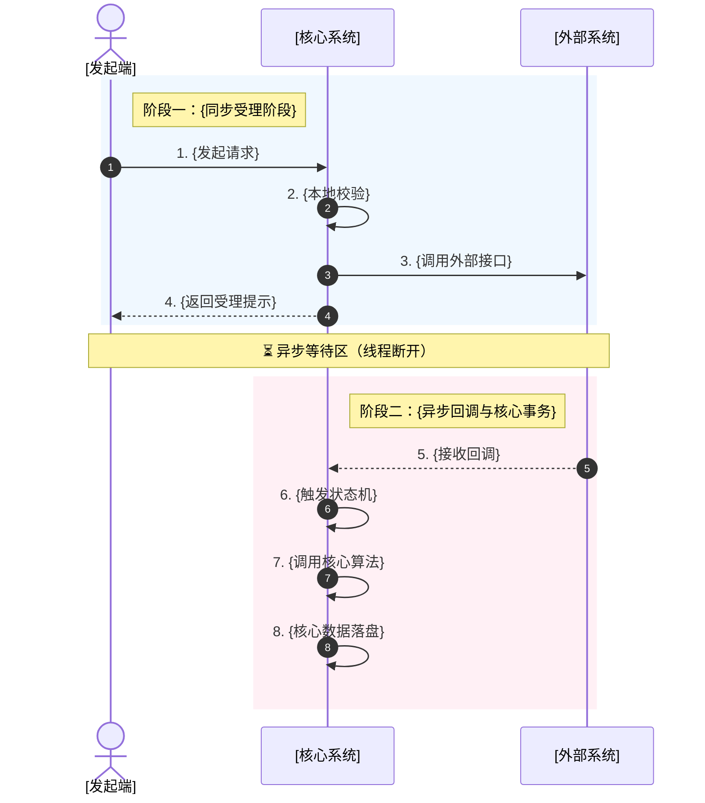

# 产品 AI PRD 范式（O.A.I.S 需求模型）

## 核心理念

抛弃视觉驱动，采用逻辑驱动。输出 AI 可以快速理解、无幻觉，且研发可以直接映射为代码架构的结构化产物。

| 维度 | 旧石器时代：视觉驱动型 PRD | AI 原生时代：逻辑驱动型 PRD |
|------|------------------------|------------------------|
| 核心载体 | 原型工具（Figma/Axure）为主 | 结构化文档（Markdown）为主 |
| 逻辑呈现 | 散落在页面周边的文字批注 | 集中于文档的"状态机"与"数据流" |
| AI 友好度 | 极低 | 极高（原生文本，支持 RAG 检索） |
| 阅读路径 | 线性阅读，页面跳转串联 | 树状读取：对象 → 状态 → 动作 → 界面 |
| 迭代成本 | 改一个逻辑，更新多个页面批注 | 改一处定义，所有引用自动生效 |
| 可测试性 | 测试用例需人工从批注中提取 | 状态机和场景表可直接转化为测试用例 |

## PRD 文件元信息

每份 O.A.I.S PRD 文件头部必须包含 YAML front-matter：

```yaml
---
version: "{版本号，如 0.7.0}"
requirement: "{需求标题}"
status: draft | confirmed | archived
created: "{YYYY-MM-DD}"
updated: "{YYYY-MM-DD}"
modules: ["{涉及模块1}", "{涉及模块2}"]
entities: ["{核心实体1}", "{核心实体2}"]
author: "{作者/AI}"
oais_version: "1.1.0"
---
```

这些元信息用于索引检索和版本追踪，确保每份 PRD 都可被程序化管理。

---

## 文档结构：O.A.I.S 四层模型

### O — Objective（业务目标）

写给"人"的北极星。用 P.A.M 三段论，一句话 + 可量化数字说清价值，拒绝"优化体验"等虚词。

```markdown
## O — Objective（业务目标）

- (P) 现状：{描述当前核心痛点，必须可量化}
- (A) 动作：{明确本次需求要做什么，边界在哪}
- (M) 指标：{定义成功标准，必须有数字}
```

**质量标准**：
- P 必须有当前数据（如"平均耗时 48 小时"、"客诉率 23%"）
- A 必须有明确边界（做什么 + 不做什么）
- M 必须有具体数字目标（如"降至 2h 以内"、"下降至 15%"）
- 如果用户未提供数字，基于业务判断给出合理估算并标注 `[待确认]`

❌ 错误示范："用户体验不好，优化退款流程。"
✅ 正确示范：
- (P) 现状：售后退款审核环节平均耗时 48 小时，导致客诉率达 23%。
- (A) 动作：引入自动化审核规则引擎，对符合条件的退款申请实现秒级自动通过。
- (M) 指标：自动审核通过率 ≥ 60%，平均审核时长降至 2h 以内，客诉率下降至 15%。

---

### A — Architecture（领域模型与业务流）

#### A.1 模块与实体总览

按业务模块划分，全局俯瞰该模块下有哪些核心实体及生死边界。

```markdown
所属模块：{例如：库内作业模块 / 翻包作业}

| 实体名称 | 核心属性（简述） | 生命周期起点 | 生命周期终点 | 依赖的上游实体 |
|---------|---------------|-----------|-----------|-------------|
| {实体A} | {填入属性} | {何时创建} | {何时消亡/闭环} | {依赖谁} |
```

**质量标准**：
- 不遗漏任何在数据流中出现的实体
- 生命周期起点和终点必须对应状态机的初始态和终态
- 上游依赖关系必须与 A.2 的关系拓扑一致

#### A.2 领域实体定义

> 灵魂拷问：实体绝对不是页面或按钮，而是业务世界中拥有唯一身份证（ID）、且状态会随业务流转而变化的"核心名词"。如果一个东西没有 ID，或者从头到尾都不会改变状态，那它就不配叫实体。

每个实体包含以下四个部分：

**实体元信息**

```markdown
| 属性项 | 定义内容 | 备注说明 |
|--------|---------|---------|
| 实体名称 | {中文名} | 业务沟通中的通用称呼 |
| 实体编码 | {英文名} | 研发代码和 AI Prompt 中使用的标准英文名 |
| 唯一标识 | {ID字段名} | 全局唯一，实体的"身份证号" |
| 业务描述 | {一句话描述} | 帮助新人和 AI 快速理解业务上下文 |
```

**核心属性定义**

```markdown
| 字段名称 | 字段编码 | 数据类型 | 必填 | 业务规则与约束 |
|---------|---------|---------|------|-------------|
| {中文名} | {英文名} | {String/Int/Enum...} | {是/否} | {唯一性、默认值、计算逻辑等} |
```

**状态机**（由"状态字典"和"状态转移表"两部分组成，缺一不可）

状态字典：

```markdown
| 状态名称 | 状态枚举值（Enum） | 业务含义说明 |
|---------|------------------|-----------|
| {中文状态} | {大写英文，如 DRAFT} | {该状态代表什么物理或逻辑意义} |
```

状态转移表（未在此表中的流转均视为非法操作）：

```markdown
| 当前状态 | 触发事件/动作 | 前置校验条件（Guard） | 目标状态 | 后置动作/副作用 |
|---------|-------------|-------------------|---------|-------------|
| {Enum} | {点击按钮/接口调用} | {必须满足什么条件} | {Enum} | {释放库存、发送MQ等} |
```

**质量标准**：
- 状态转移表必须覆盖所有合法路径，不能有孤立状态（无法到达或无法离开的状态）
- 每个触发事件必须有明确的前置校验条件，即使是"无"也要显式写出
- 后置动作必须列出所有副作用，包括对其他实体的影响

**实体关系拓扑**

```markdown
| 关联实体 | 关系类型 | 业务说明（约束） |
|---------|---------|---------------|
| {其他实体名} | {1对1/1对N/N对N} | {如：一个箱子同一时刻只能在一个库位上} |
```

#### A.3 核心数据流与交互

上帝视角，描述业务流程如何跨系统调用并串联各实体。

**触发源**：说明由谁、在什么端、做了什么动作触发。

**Mermaid 时序图**：按阶段划分（同步受理 → 异步回调 → 前端闭环），用 `rect` 色块区分阶段，用 `note` 标注异步断点。



**节点执行详情**：按阶段划分，每个节点说明执行动作、异常分支、状态联动。

**质量标准**：
- 时序图中每个状态变更步骤必须能在 A.2 的状态转移表中找到对应行
- 异步断点必须用 `note` 显式标注
- 异常分支必须在节点详情中说明，并与 S 层场景对应

#### A.4 核心规则与算法

将 A.3 中复杂计算逻辑抽离至此，避免打断主流程阅读。当某一步逻辑用一两句话说不清楚（分配、匹配、算钱、排序），就拎到这里写。

```markdown
规则 X：{规则名称}
{业务描述和逻辑描述}

算法 X：{算法名称}
{输入、输出、伪代码、不变量}
```

---

### I — Interface（人机交互层）

页面只是实体数据的"投影"。用结构化文本描述页面，AI 即可自动生成前端代码。

```markdown
### 页面 N：{页面名称}

- **交互端**：{Web / PDA / APP}
- **数据源**：{绑定哪个实体，ID 从何获取}
- **页面结构**：
  - 顶部区：{展示哪些字段}
  - 中部区：{展示哪些字段/列表}
  - 底部操作区：{按钮名称} → {触发什么事件} → {改变实体什么状态}
- **权限控制**：{谁可见，谁可操作}
- **校验规则**：

| 校验项 | 校验逻辑 | 报错提示 |
|--------|---------|---------|
| {字段} | {规则} | {提示文案} |
```

**APP 端特殊要求**：
- 每种扫描方式必须说明是精确查询还是模糊查询
- 每个字段都要给出取值方式（扫描获取 / 手动输入 / 接口返回 / 本地计算）
- 离线场景下的数据缓存策略

**质量标准**：
- 每个页面的数据源必须在 A.2 中有对应实体定义
- 每个按钮的事件必须在 A.2 状态转移表中有对应行
- 权限控制必须与 S 层 Security 场景一致

---

### S — Scenarios（边界与异常场景）

正向流程只占 20%，异常边界决定系统的生死。使用 SECURE 框架穷举异常，作为 AI 生成代码的"护栏"和测试用例。

区分 A.3 和 S 的职责：
- A.3 告诉你：正常情况下怎么走到终点；遇到红灯怎么停下。
- S 告诉你：如果有人酒驾、如果桥塌了、如果天上下冰雹了，系统能不能活下来。

**SECURE 框架**：

| 类型缩写 | 类型全称 | 含义 | 典型场景举例 |
|---------|---------|------|------------|
| S | Security（安全越权） | 跨权限、跨租户、越权操作 | 用户 A 能看到用户 B 的数据吗？ |
| E | Error（异常/超时） | 接口超时、系统宕机、数据异常 | 调用 WMS 接口超时 30s 怎么办？ |
| C | Concurrency（并发控制） | 多人同时操作、防超卖 | 两个人同时拣同一个库位？ |
| U | Undo（可逆性） | 操作后能否撤销、如何修正 | 确认收货后发现数量错了？ |
| R | Restriction（业务约束） | 业务规则限制、状态冲突 | 已关闭的单据能重新打开吗？ |
| E | Edge（边界值） | 0值、负数、超限、空值 | 数量为 0 的明细行怎么处理？ |

```markdown
| 场景编号 | 场景类型（SECURE） | 场景描述 | 前置条件 | 预期系统行为（前端提示 & 后端处理） |
|---------|------------------|---------|---------|-------------------------------|
| SCN-S-01 | Security | {描述} | {条件} | {行为} |
| SCN-E-01 | Error | {描述} | {条件} | {行为} |
| SCN-C-01 | Concurrency | {描述} | {条件} | {行为} |
| SCN-U-01 | Undo | {描述} | {条件} | {行为} |
| SCN-R-01 | Restriction | {描述} | {条件} | {行为} |
| SCN-E-02 | Edge | {描述} | {条件} | {行为} |
```

**质量标准**：
- 六类至少各一条，核心流程的异常场景要穷举
- 每个场景的"预期系统行为"必须同时包含前端提示和后端处理
- 并发场景必须说明锁策略（乐观锁/悲观锁/分布式锁）
- Error 场景必须说明重试策略和最终兜底方案

---

## 自检矩阵（PRD 生成后必须执行）

| 检查项 | 检查方法 | 不通过的处理 |
|--------|---------|------------|
| 状态机完整性 | 每个实体的状态转移表是否覆盖所有合法路径？有无孤立状态？ | 补全缺失路径或删除孤立状态 |
| 数据流-状态机一致性 | A.3 时序图每个状态变更步骤是否在 A.2 状态转移表中有对应？ | 补全状态转移表或修正时序图 |
| 界面-实体绑定 | I 层每个页面数据源是否在 A.2 中定义？ | 补全实体定义或修正页面数据源 |
| 按钮-事件链路 | I 层每个按钮事件是否在状态转移表中有对应？ | 补全状态转移或修正按钮定义 |
| 场景覆盖度 | S 层是否覆盖 A.3 数据流中每个异常分支？ | 补全缺失场景 |
| O-M 可验证性 | O 层的 M 指标是否可以通过系统数据验证？ | 修正为可量化可采集的指标 |
| 实体关系一致性 | A.2 关系拓扑是否与 A.1 总览和 A.3 数据流一致？ | 统一三处的关系描述 |

---

## 使用规则

1. 所有需求文档必须包含 O.A.I.S 四层，缺一不可
2. O 层必须有 P.A.M 三段论，M 必须有数字
3. A 层实体必须有状态机（状态字典 + 状态转移表），无状态变化的不算实体
4. A 层数据流必须有 Mermaid 时序图，按阶段划分
5. I 层每个页面必须标明数据源绑定的实体和交互端
6. S 层必须覆盖 SECURE 六类场景，至少各一条
7. 复杂逻辑（分配、匹配、计算）必须抽到 A.4 单独描述
8. PRD 生成后必须执行自检矩阵，不通过的项必须修正或标注 `[待确认]`
9. 实践中发现规范不足时，通过反馈机制持续迭代本文档

---

## 规范反哺机制

本文档是活文档，随实践持续迭代。反哺流程：

1. 在实际生成 PRD 时发现规范未覆盖的情况
2. 在 PRD 文件末尾的"O.A.I.S 规范反馈"区记录发现
3. 提醒用户并获得确认
4. 更新本文档，递增 version，在 changelog 中记录变更
